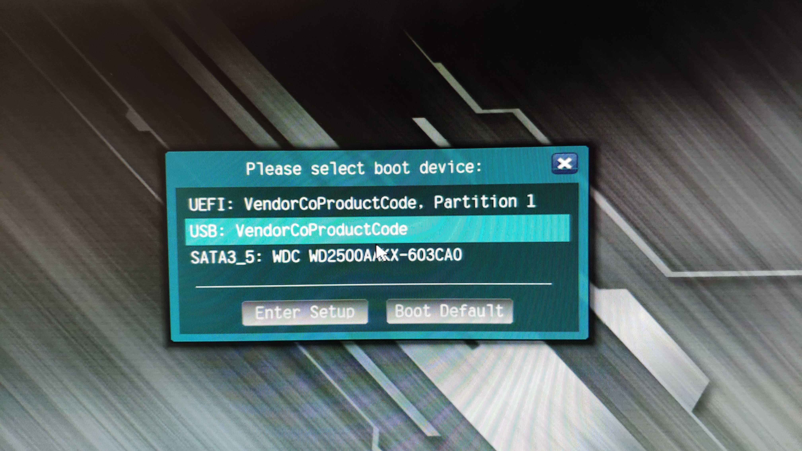

# lab#00 Get the environment prepared

In this class, we are going to do labs on Windows and Linux (openSUSE). Since most of  labs are basically in introductory level, it doesn't make a big difference what version of Windows or Linux you use. However, to avoid unnecessary trouble, you should all use Windows 10 and openSUSE 13.2 with 64 bits provided below.

We will install Windows 10 on a hard drive (Host Machine), and create a Virtual Machine(VM) with VirtualBox running Linux.

Note: Except for USB devices and hard disks, all software may be provided in class, alternatively, you can download them ahead of class.

[TOC]

## Windows Host Machine set up

### Get prepared

#### Get a SATA hard drive(100+GB)

The following manual is based on a brand-new hard drive. Alternatively, you can use a hard drive without any personal data.

Note: There are several kinds of interface of hard drives, only SATA, SATA3, and SATAe are working here.

#### Get OS image files

| OS                       | URL                                                          |
| ------------------------ | ------------------------------------------------------------ |
| Windows-10               | Use the official [Media Creation Tool](https://www.microsoft.com/en-us/software-download/windows10) to download the OS image file(.iso). See step-by-step tutorial in Appendix. https://www.microsoft.com/en-us/software-download/windows10 |
| openSUSE-13.2-DVD-x86_64 | https://ftp5.gwdg.de/pub/opensuse/discontinued/distribution/13.2/iso/openSUSE-13.2-DVD-x86_64.iso |

### Make a Windows bootable USB

On your Windows laptop/PC, 

1. Install software [rufus](https://ubuntu.com/download/desktop/thank-you?version=18.04.3&architecture=amd64) (click it to download directly from https://rufus.ie)

2. Get known about your firmware on your motherboard. (BIOS or UEFI). 

   ​	There are two kinds of machine in the laboratory. The one with one single hard-drive slot (referred by **type 1** below) only supports BIOS, while the other (with multiple hard drives, referred by **type 2**) supports UEFI and BIOS (legacy). 

   ​	In our lab, **always choose BIOS**.

Note: If you wanna to make a dual-boot, ENSURE you always use the SAME bootable mode(BIOS or UEFI). Otherwise, take any potential risk at your own.  

3. Insert your USB device.

4. Run rufus to make a bootable USB.
	* Make sure it is your USB device (eg. check the size).
	
	* Choose the Windows 10 image file you just downloaded.
	
	* Choose your boot mode.  (Again, in our lab, **always choose BIOS**.)
	

	* Confirm and wait for completion.

If you are a Mac user, use [UNetbootin](https://github.com/unetbootin/unetbootin/releases/download/675/unetbootin-mac-675.dmg) to do the same thing. Refer to https://unetbootin.github.io/. 

### Install Windows on the hard drive

#### Before installation

1. Insert hard disk case to the machine with your hard disk installed and lock down, if you forget to lock the hard disk case, the hard disk might not work.
2. Insert the bootable USB to the same machine.
3. Restart computer if it is already on.    

#### Installation

1. Enter Boot Menu and select your USB devices to boot (again, **under the BIOS/legacy mode**).
   * With type 1 machines, directly tap F9 or press ESC and later choose "Boot Menu" after it starts. Select your USB device to boot(Here the label is "VendorCoProductCode".
   
     
   
   * With type 2 machines, tap F11 when you boot. Select your USB device (the one without the UEFI label when there are two entries)
   
     
   
     
   
2. Following the instruction and complete the installation with your account set up. 
	* No need to connect to WIFI, actually all of the security machines are offline. 
	
	* Without specific warning, just leave everything default.
   
     1. Confirm default language, zone, and keyboard and later click "Install Now"
     
     2. Click "I don't have product key"
     
        
     
     3. Select a version of Windows to install. Basically, all of them are working for the labs. Since the Pro has most features, we choose pro.
     
        
     
     4. Check license terms and Next.
     
     5. Select "Custom: Install Windows only (advanced)".
     
     6. Delete all current partitions if there are. Just leave a empty unallocated hard drive there.
     
        Attention: If you are using an used disk with personal data, it is fine to keep them with sufficient partition background. Otherwise, just follow this manual, unless you do have a particular situation.
     
        
     
     7. Select the drive and click button "New" to create a new partition. 
     
        Give it at least 100 GB (=102400 MB). 
     
        
     
        Note: 100 GB is big enough for our labs. **You are free to use the entire disk**, at your own risk. It is a good habit to make a partition as small as it needs to be, so that you could create multiple partitions to make the best use of the disk. It helps to avoid data loss when OS errors happen by saving personal data in isolated partitions. In addition, multiple partitions make your hard drive versatile, for example, making a dual-boot. 
     
   
     8. Confirm the pop up for Windows build-in partition policy.
     
        
        
     9. Now Windows Setup program has created two partitions for you within exact 100 GB space.
     
        Select the primary partition and start the installation.
     
        
     
        

   

#### After installation

#####  Hardware drivers

Usually right after we newly install a Windows on the hard drive, we need to install relevant drivers to achieve best performance (especially for personal usage). However, here we don't really need to install any drivers. Network Adapter is automatically working on Windows 10. 

Note: You should sit at the same seats and **use the same machines** throughout the labs. Otherwise, you hard drive won't be able to boot (from another machine). For more details, it is a problem only on Windows Host Machines. (Linux works well.)

##### Useful software

Here are some good software and tools I recommend to you. 

Offline copy might be able to provided and alternatively you could download them ahead of class.

| Name                                                         | Description                                      |
| ------------------------------------------------------------ | ------------------------------------------------ |
| [LibreOffice](https://www.libreoffice.org/download/download/) | Free and open source replacement for Offices 365 |
| [Picpick](https://picpick.app/en/download/)                  | Amazing screenshot tool                          |
| [Firefox](https://www.mozilla.org/en-US/firefox/new/)        | Internet Browser                                 |
| [FoxitReader](https://www.foxitsoftware.com/downloads/)      | Free PDF reader                                  |

## Linux Virtual Machine set up

### Get prepared

#### Install VirtualBox

Download and install the [Virtual Box](https://www.virtualbox.org/wiki/Downloads).

#### Download the Image file

Download the Linux image file with the link above.

### VM configuration

#### Set up basic VM configuration

1. Open VirtualBox and click blue Button "New".

2. Give it a meaningful name such as openSUSE or suse. Select type "Linux" and Version "openSUSE(64 bits)".

3. Allocate enough memory to the VM of at least 1024 MB (2048 MB recommended). Insufficient memory will result in formidable problems.

4. Select options "create a virtual hard disk now". 

   It will create files in your host machine supporting the VM, so make sure there are at least 20GB available in your host machine.

5. Select "VDI".

6. Select "Dynamically allocated".

7. Decide file location. Set the size limitation. It should be at least 20GB.

#### Insert Linux image file 

It is emulating CD/DVD player to install an OS, in essence.

8. Select the VM and click the orange button "Setting".

9. Select the Empty disc under the "Storage" on the left panel, click the button on the right.  

   

   

10. Select "choose disk file" on the drag-down menu, choose the image file "openSUSE-13.2-DVD-x_64.iso" in your machine.

#### Set up network

11. Select "Network" on the left pane. Select "Bridged-Adapter".

#### Add shared folders

Add a shard folder to share file with the VM for your convenience in the labs.

12. Select "Shared Folders" on the left pane. Click the button "Add new Shared folder".

13. Select a folder that you want to share with the VM. 

    

    Check the box "Auto-mount".
    

    So far, are we good? Next it is time to boot the VM!

### VM Installation

#### Boot from the disc

14. Back to the VM manager window, (select the VM and) click the green button "Start".

If a warning popped up (shown below), confirm it and continue. If it is not booting, manual choose openSUSE in the option list. Otherwise, go back to step 9&10.

15. Now you should see it booting, select installation.

Basically leave everything default.

#### Partitioning

16. Suggested Partitioning. Leave it default.

#### Clock and Time Zone

17. clock and Time Zone. 

#### Desktop Selection

18. Desktop Selection. Leave it to KDE by default.

19. Make sure you check the box "Use this password for system administrator". It is checked by default.

#### Settings Overviews

20. Overviews of your settings. Continue to install.

#### Remove bootable disc

21. Finally you have grown through this long journey and have it successfully installed. Just one more thing before we cheer, you need to remove the optical drive just like unplugging your bootable USB when the Windows installation is completed on a host machine! 

    The VM will restart automatically, just close the window and choose "Power off".

    

    Back to VM settings, go to "storage", select the openSUSE disc and click the button on the bottom to remove it.

    

    Now you are free to restart the VM!
    
    

#### Exclusive bug of openSUSE 13.2

Unfortunately, there is a network problem within this version of openSUSE. 

**Every time you boot from it**, the network manager is not running automatically for some reasons.  

It could be resolved by manually restarting the Network Manager service.

1. Click the openSUSE icon on the left-bottom corner.
2. Select App "Terminal" in the "Favorites" column.

3. Run command `sudo systemctl restart NetworkManager`. 

   You will be asked for root password which is the same as your password for current user. Do you remember the box "Use this password for system administrator" is checked when we create the user?

   The password you input is intended to be invisible by Linux to make it secure. Sound interesting?

   

4. Good to go!

   

## Appendix

### Download Windows 10 image file with official Media-Create-Tool

1. Download the tool from https://www.microsoft.com/en-us/software-download/windows10.

2. Run it and Accept the policy.

3. Select "Create Installation Media".

   

   

4. Select target version. (use default)

   

   

5. Select "ISO file" and decide wherever you prefer to save it.

   