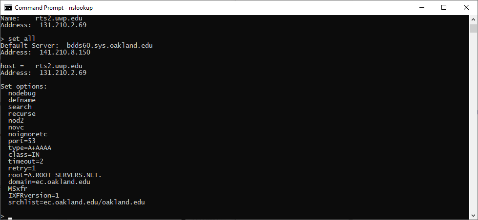

# Lab#01 Network Reconnaissance Using Command Line

### Descriptions

##### Course Number: CSI 4480/5480

##### Semester: Winter 2020

##### Instructor: Khalid Malik Mahmood

##### Group Number: (Replace the placeholder below)

?

##### Student Names: (Replace the placeholder below)

Firstname1 Lastname1

Firstname2 Lastname2

### Common Rules

#### About lab work

* Every group (consisting of two members) should finish the lab independently. Discussion about the big picture is allowed among groups. 
* No print screen will be accepted for the answers unless mentioned otherwise, but it is a good habit to attach a screenshot to your answer in case you have a special situation where your observation is different from others but you have correctly operated.
* Each group should show that they understand what they are doing and ask the instructor or the TA when a question is unclear. **Please read the lab material before answering the questions.**
* No print screen will be accepted for the answers unless mentioned otherwise.

#### About submission

Please submit to **Moodle Submission** of Lab Footprinting link. 

* Turn in **one single PDF file per group**.
* Give it an **informative** name following the pattern `Lab#??_group#?.pdf`. For example, `Lab#01_group#1.pdf`.
* **No late submission will be accepted.** Contact the professor/TA for extension ahead in case of any exception.

#### About this documents

This document is originally written in basic [Markdown](https://www.markdownguide.org/getting-started) format and then exported to a Word file.  

Refer to Markdown [cheatsheet](https://www.markdownguide.org/cheat-sheet/) in case of any format question. 

You are encouraged to use any Markdown Editor (eg. Typora) to finish your lab report (downloaded the original .md file from the URL provided), while MS Word file will be provided.

## Lab Details

### Lab Objective

Network reconnaissance consists of multiple activities designed to map out the size and scope of targeted network using Internet utilities. For example to find out available servers, border routers, we can do basic network reconnaissance using `nslookup`, `ping` and `traceroute`.

### Lab Content

#### DNS

Read page 18 of the book to review the types of records of DNS and answer the following questions.

##### Questions

###### Q1.1
1. What is purpose of A record, NS record and SOA record?

   
###### Q1.2
2. What is purpose of MX record?

   
###### Q1.3
3. What is DNS Zone Transfer?

   
###### Q1.4
4. Go to https://www.sans.org/top25-software-errors/. This URL contains Top 25 most dangerous software flaws. You will notice all of flaws are categorized into three categories. What are the main three categories?

   
###### Q1.5
5. After you have completed Q4, Investigate the following two flaws by clicking the following two CWE# link. Summarize the **consequences** and its **prevalence**.
   * [http://cwe.mitre.org/top25/index.html#CWE-759](http://cwe.mitre.org/top25/index.html#CWE-759)	
   * http://cwe.mitre.org/top25/index.html#CWE-434

#### NSLOOKUP

Refer to **Lab3.1A** in the book to complete the following hand-on activities.

Use **security lab computer** from now on.

##### Hand-on activities

1. In Windows, open a command prompt window.

2. Enter `nslookup` to begin operating in the interactive mode. Enter `exit` to exit whenever you want to.

   Note: You can lookup one host_name or IP address by running `nslook <host_name|ip_address>`, or in a interactive mode, just input `<host_name|ip_address>`. You are free to perform a lookup in either way.

###### Q2.1

What information did this command provide you with? 

3. Look up `pita.hackquarters.com`.

###### Q2.2

What is the IP address that corresponds to this domain name? 

4. Look up `lampstack.hackquarters.com`

###### Q2.3

What is the IP address that corresponds to this domain name? What does this mean?

5. Look up  `win7.hackquarters.com`.

###### Q2.4

What is the IP address that corresponds to this domain name?

6. Look up `192.168.2.38`.

###### Q2.5

What is the domain name that corresponds to this IP address?

7. Look up `192.168.2.19`.

###### Q2.6

What is the domain name that corresponds to this IP address?

Use the **All-in-one computer** from now on.

8. Run `nslookup` (in a command prompt window).

###### Q2.7

What information did this command provide you with? 

9. Look up `www.oakland.edu `.

###### Q2.8

What is/are the IP address/addresses that correspond to this domain name? 

What does this means?

10. Look up `www.google.com`

###### Q2.9

What is/are the IP address/addresses that correspond to this domain name? 

What does this mean? 

What are the versions of the IP addresses that have been used?

###### Q2.10

What does the statement Non-authoritative answer mean?

11. Look up `141.210.2.69`

###### Q2.11

What is the domain name that corresponds to this IP address?

12. Enter `set all` in interactive mode to determine the current settings as shown below.  (Refer to step 9 in the book)

    

13. Enter `set type=MX` (Refer to step 10 in the book)

14. Enter `oakland.edu`

###### Q2.12

Why did we get different results? 

What is/are the mail exchange server/servers of OU? 

And What is the primary name server responsible for the exchange server’s DNS registration?

15. Enter `google.com`

###### Q2.13

Why did we get different results? 

#### PING

Read Page 70 to 71 in the book.

Use the security lab computer now.

##### Hand-on activities

1. Run `ping 192.168.2.1` in a command prompt.

###### Q3.1

How many ICMP echo requests were generated from your computer?

#### TRACEROUTE

Refer to page 71 to 72 in the book.

Use the all-in-one computer now.

##### Hand-on activities

1. Run `tracert www.oakland.edu`

###### Q4.1

How many routers did each packet pass to reach the destination? 

How many packets does `tracert`command use to investigate the route? 

2. Run `tracert  www.google.com`

###### Q4.2

How many routers did each packet pass before the request was timed out? 

Why was the request time out? 

Use the security computer now.

3. Run `tracert 192.168.2.1`

###### Q4.3

How many routers did each packet pass to reach the destination? 

How many packets does `tracert`command use to investigate the route? 

4. Run `tracert  192.168.2.19`

###### Q4.4

How many routers did each packet pass before the request was timed out? 

Why was the request time out? 

5. Run `tracert  192.168.2.20`

###### Q4.5

How many routers did each packet pass before the request was timed out? 

Why was the request time out? 

###### Q4.6

Figure out what the IP address are that corresponds to each of the following domain names (use security computer)?

| Computer Name              | IP address |
| :------------------------- | :--------- |
| Xp.hackquarters.com        |            |
| PITA.hackquarters.com      |            |
| Lampstack.hackquarters.com |            |
| Win7.hackquarters.com      |            |
| DNS1.hackquarters.com      |            |
| DNS2.hackquarters.com      |            |
| Nagios.hackquarters.com    |            |
| Repo.hackquarters.com      |            |
| Share.hackquarters.com     |            |

###### Q4.7

Based on what you have learned so far about footprinting, write a brief report to demonstrate that you may apply it to organization of your choice. 

